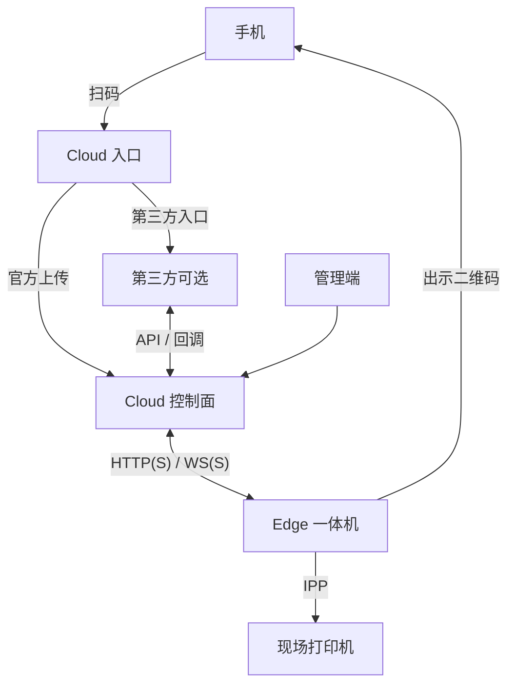
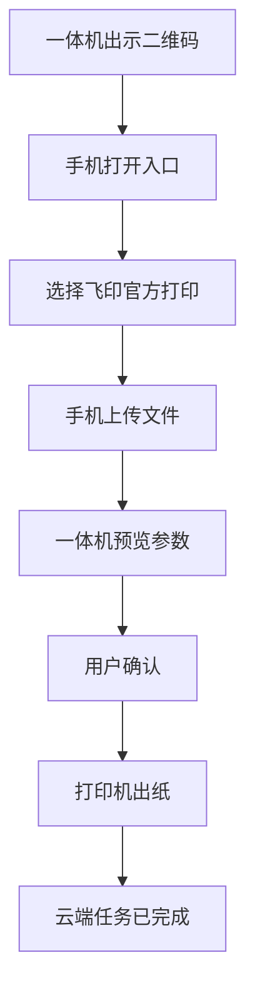
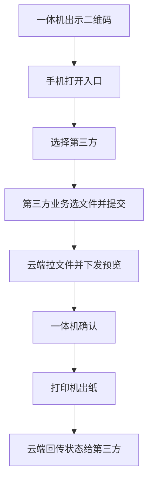

# 飞印（FlyPrint）系统说明

| 属性 | 说明 |
|------|------|
| 文档类型 | 产品与体系结构说明 |
| 适用产品 | 飞印云打印平台（Cloud 控制面 + Edge 一体机终端） |
| 修订说明 | 描述产品行为、结构分层与安全边界；不替代接口契约与运维操作说明 |

---

## 1. 概述

飞印是面向自助与现场场景的**通用云打印平台**。系统由云端控制面（Cloud）与一体机终端（Edge）组成：Cloud 负责任务编排、文件与凭证、节点及打印机登记；Edge 负责出示二维码、用户预览确认，并经 **IPP** 将文档提交至现场打印机。

**Cloud 不直接连接现场打印机。** 所有出纸均由 Edge 经 IPP 完成。用户须在一体机上预览并确认后，系统才会创建正式打印任务。第三方业务系统仅通过 Cloud 集成接口下单，不得直连 Edge 或打印机。

常见部署形态：一套 Cloud，多校区各部署一台 Edge，Edge 出站连接 Cloud。  
入口形态：局域网默认主机端口 **8012**；公网发布包主机 **:80**，管理端路径 `/fly-print-web`，API 路径 `/fly-print-api`。

本文按四级结构说明产品组织方式：

| 层级 | 含义 |
|------|------|
| **L0** | 完整产品 |
| **L1** | 参与方与部署关系 |
| **L2** | 各参与方内部结构与运行组成 |
| **L3** | 能力与职责分区（不含实现细节） |

接口字段、签名算法、安装步骤与界面操作分别见对接契约、部署说明及使用/运维说明。

---

## 2. L1 — 参与方

| 参与方 | 说明 |
|--------|------|
| **Cloud** | 云端控制面，含管理端、入口页与业务 API |
| **Edge** | 校区一体机终端 |
| **手机** | 用户侧浏览器，用于扫码与选入口 |
| **现场打印机** | 接收 Edge 提交的打印作业并出纸 |
| **第三方（可选）** | 经 Cloud 标准接口下单、查询状态并接收回调；不得直连打印机或跳过一体机确认 |
| **学校管理侧** | 通过 Cloud 管理端进行监控、激活、配置与派单；非独立运行进程 |

### 2.1 逻辑关系



用户扫码首先进入 Cloud **入口页**，再选择官方上传或第三方入口；第三方经标准接口回传至控制面。管理端仅连接 Cloud。对外支持 **HTTP 或 HTTPS**（WebSocket 对应 **ws / wss**）。

### 2.2 部署关系

```text
                    ┌──────────── Cloud 机房 / 公网 ────────────┐
  学校管理侧 ──────►│  Cloud（唯一控制面）                       │
  手机扫码 ────────►│  对外通常仅开放 :80（或经负载均衡回源）     │
                    └──────────────────▲────────────────────────┘
                                       │ Edge 出站访问
              ┌────────────────────────┼────────────────────────┐
              │                        │                        │
         校区 A Edge              校区 B Edge                  …
              │                        │
           现场打印机               现场打印机
```

---

## 3. L2 — 内部结构

### 3.1 Cloud

**逻辑组成：**

| 组成 | 职责 |
|------|------|
| 统一入口 | 对外反向代理，将访问分发至管理端或 API |
| 管理端 | 学校管理侧使用的 Web 后台 |
| API 控制面 | 业务 API、扫码入口与上传、任务编排、Edge WebSocket、第三方集成 |
| 数据面 | 数据库、缓存、对象存储 |
| 集成演示（可选） | 同机部署的第三方对接示例，非正式业务必选组件 |

**运行组成（Compose 典型部署）：**

| 服务 | 对应逻辑组成 |
|------|----------------|
| `nginx` | 统一入口 |
| `api` | API 控制面 |
| 管理端静态资源（经 nginx 提供） | 管理端 |
| `postgres` | 数据面 · 数据库 |
| `redis` | 数据面 · 缓存 |
| `minio` | 数据面 · 对象存储 |
| `integration-demo`（可选） | 集成演示 |

数据库、缓存与对象存储不对公网暴露；公网流量通常仅进入 `nginx`。

### 3.2 Edge

| 组成 | 职责 |
|------|------|
| 云连接 | 按 `cloud.base_url` 访问 Cloud（HTTP(S) 与 WS(S)） |
| 用户大屏 | 出示二维码、占用遮挡、预览确认、打印过程与结果提示 |
| 本机管理 | 激活、云端地址、IPP 发现与默认打印机、日志等；默认仅本机 `127.0.0.1:7860` 可达，无独立本机管理员密码 |
| 打印执行 | 将已确认作业经 IPP 提交至现场打印机 |

手机、现场打印机与第三方系统在本层不再展开：手机为浏览器，打印机为 IPP 设备，第三方为外部业务系统。

---

## 4. L3 — 能力分区

### 4.1 Cloud · API 控制面

| 分区 | 职责 |
|------|------|
| 身份与管理登录 | 管理端登录与会话 |
| 节点与打印机 | 激活、在线状态、登记与启停 |
| 文件与凭证 | 上传/下载令牌及对象存储访问 |
| 入口会话 | 扫码入口、终端票据、一机占用 |
| 打印任务 | 编排、下发预览、接收终态 |
| 第三方集成 | 接入方配置、入站/出站鉴权、状态回调 |
| Edge 通道 | WebSocket 指令与状态同步 |

### 4.2 Cloud · 管理端

| 模块 | 能力 |
|------|------|
| 仪表盘 | 告警与任务汇总 |
| 边缘节点 | 激活、在线、别名、启停；关联联系人、打印机与任务 |
| 运维人员 | 维护展示用联系人（姓名与电话）并与节点绑定 |
| 打印机 | 显示名、启停、所属节点 |
| 打印任务 | 查询状态、发起方与错误信息 |
| 业务配置 | 上传大小与页数、凭证有效期、扩展名等 |
| 第三方接入 | 接入方、密钥创建与轮换、启停与入口是否显示 |

官方扫码流程中的公开上传页**无需**管理端登录。

### 4.3 Edge · 用户大屏

| 状态 | 说明 |
|------|------|
| 扫码待机 | 展示二维码；定时刷新；故障或占用时遮挡 |
| 一机占用 | 用户进入后遮挡二维码；可刷新以作废旧会话 |
| 预览确认 | 设置份数、双面、色彩等参数并确认 |
| 打印中 | 不可中断返回扫码页 |
| 完成提示 | 成功、失败及缺纸、缺粉等 |

### 4.4 会话与票据

| 对象 | 作用 |
|------|------|
| 上传凭证 | 扫码进入口；校验成功后换发终端票据 |
| 终端票据 | 将本次业务绑定到指定终端与打印机；第三方仅持有该票据 |
| 占用通知 | Cloud 通知 Edge 遮挡二维码 |
| 入口重选 | 尚未上传或尚未向第三方提交前，可返回入口重新选择 |

官方打印与第三方打印均先完成「入口 → 终端票据 → 占用」，之后分别进入上传页或第三方入口。

### 4.5 打印任务概念

| 概念 | 说明 |
|------|------|
| 打印机寻址 | 以 Cloud 侧打印机标识为准 |
| 收件确认 | Edge 已收件落盘不等于设备已打印完成 |
| 终态 | 完成、失败、取消、未确认等，并带有稳定事件标识 |
| 未确认 | 打印结果不明；禁止静默自动重打 |

---

## 5. 端到端业务流程

### 5.1 官方打印



二维码通常携带上传凭证进入入口；校验后换发终端票据并通知一体机占用；官方打印再进入上传页。终端票据有效期约 5 分钟，且不超过上传凭证剩余时间。

### 5.2 第三方打印



字段、签名与状态机以对接契约为准，本文不重复接口细节。

### 5.3 网络地址约定

| 链路 | 配置要点 | 常见错误 |
|------|----------|----------|
| 手机 / 浏览器 → Cloud | 用户可达的 Cloud 地址（公网子路径含 `/fly-print-web`、`/fly-print-api`） | 对手机使用 `localhost` |
| Edge → Cloud | 与手机侧 API 根一致，写入 `cloud.base_url` | 公网子路径漏写 `/fly-print-api` |
| Cloud → 第三方回调 | Cloud **出站**可达的回调基址 | 将手机访问地址误用作容器内回调地址 |

同机集成演示：回调地址常用 `http://integration-demo:8080`；手机入口使用反代路径 `/integration-demo/entry`。

---

## 6. 产品边界

- 打印链路为「文档 → 标准 PDF → IPP Print-Job → 设备完成」。  
- Edge 不提供 Spooler / WSD / RAW 等替代打印回退。  
- 作业结果为「未确认」（`unconfirmed`）时，禁止静默自动重打。  
- Cloud 对外地址、Edge `cloud.base_url`、第三方入口/回调/文件地址均支持 HTTP 与 HTTPS（URL 不得含 userinfo）。  
- 出站使用系统默认信任链；不支持将自签证书作为默认可信出站信任。  
- REST 跟随 `cloud.base_url` 协议；WebSocket 自动映射为 ws 或 wss。  
- 以 `localhost` / `127.0.0.1` 作为出码基址时，可能被改写为局域网 IP；在 HTTPS 场景下易导致证书主机名校验失败，公网应直接配置域名。

技术选型摘要：Cloud 为 Go（Gin）、PostgreSQL、Redis、对象存储、WebSocket，管理端为 React；Edge 为 Python 运行时与本机界面，用户页由 Microsoft Edge 全屏 kiosk 启动；Cloud 以 Docker Compose 或发布包交付，Edge 以 Windows 安装包交付。

---

## 7. 范围说明

| 项 | 说明 |
|----|------|
| 本文范围 | 产品结构（L0～L3）、主路径流程、边界与地址约定 |
| 不在本文 | 安装与排障步骤、界面操作说明、第三方接口字段与验签细节 |
| 自签证书出站信任 | 不支持 |
| 多租户计费、完整用户中心、远程升级等 | 按版本规划另行交付 |
| 传输形态 | 支持 HTTP/HTTPS 双兼容；是否在具体环境强制 HTTPS 由部署策略决定 |
