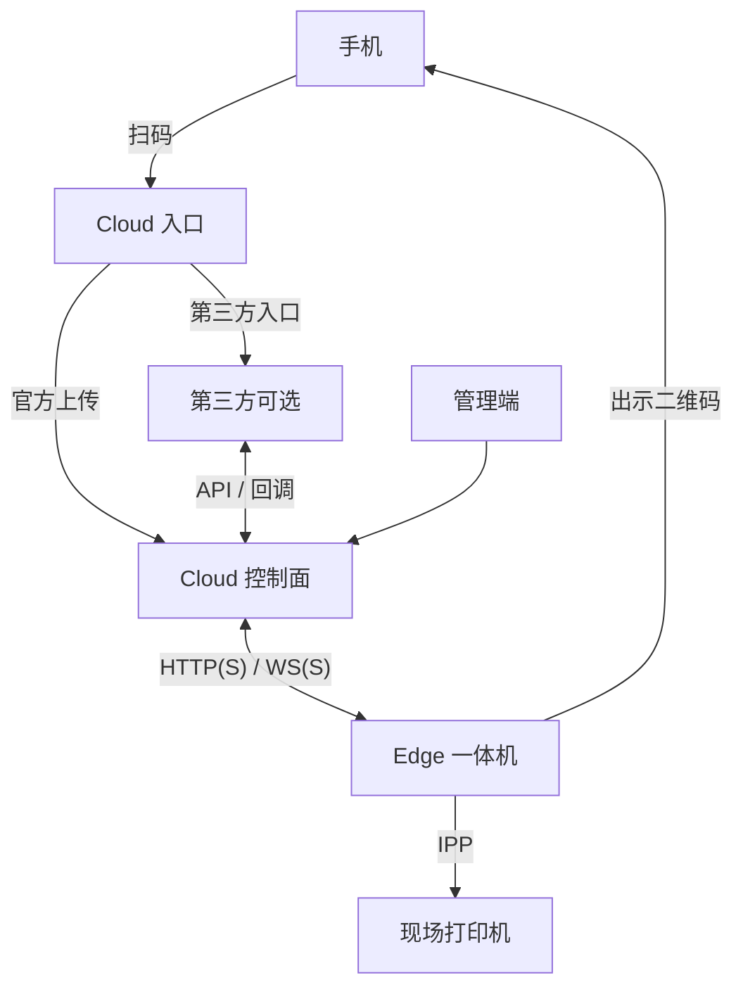
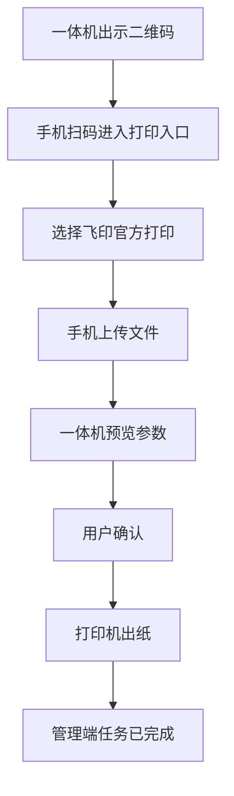
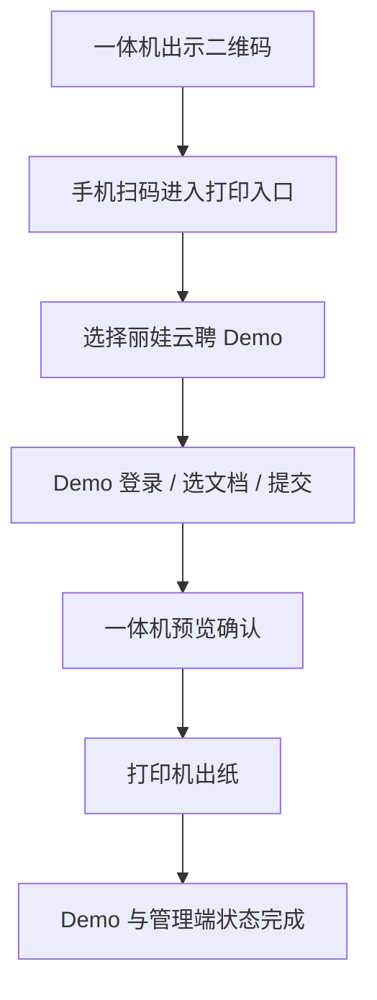

# 飞印（FlyPrint）验收汇报稿

| 属性 | 说明 |
|------|------|
| 文档类型 | 验收宣讲稿（老板 + 技术旁听，不抠实现细节） |
| 现网 | Cloud 已部署公网；入口先仅 **HTTP / 80** |
| 校区形态 | **一套公网 Cloud** + **两校区各一台 Edge**，Edge 直连公网 Cloud |
| 章节顺序 | 整体定义 · 功能简述 · 技术框架 · 业务流程与演示 · 学校侧运维资源 · 当前位置与展望 |

---

## 1. 整体定义

飞印是面向自助与现场场景的**通用云打印平台**：

- **云端（Cloud）** 负责编排、文件与凭证、节点与打印机登记、对外入口与第三方集成。  
- **一体机（Edge）** 负责出示二维码、用户预览确认，并经 IPP 将文档提交至现场打印机。  
- 用户用手机扫码；学校通过管理端监控与配置；可选第三方业务系统经标准接口下单。

**三条硬边界：**

1. Cloud **不**直连现场打印机，出纸只发生在 Edge → 打印机。  
2. 用户须在一体机上**确认**后，才形成正式打印任务。  
3. 第三方不得绕过一体机确认，不得直连打印机。

---

## 2. 功能简述

| 参与方 | 能做什么 |
|--------|----------|
| **Cloud** | 管理登录与后台；登记节点与打印机；管理文件与凭证；编排打印任务；与一体机长连接；接收第三方标准下单并回传状态 |
| **Edge** | 出示二维码；全屏用户界面；预览与确认；把文档打到现场打印机；回传在线状态与任务结果 |
| **手机** | 扫码进入打印入口；选择官方上传或第三方入口 |
| **现场打印机** | 接收一体机提交的打印作业并出纸 |
| **第三方（可选）** | 经 Cloud 标准接口下单、查询状态、接收回调 |
| **学校管理侧** | 通过管理端监控在线与任务、发放激活码、配置与启停、派现场运维 |

主路径两条：**官方扫码上传打印**，以及可选的**第三方对接打印**（本阶段以集成 Demo 验证）。

---

## 3. 技术框架

### 3.1 逻辑关系



扫码先进入 Cloud 入口，再选择官方或第三方；第三方经标准接口回到控制面。

### 3.2 当前部署形态

```text
公网 :80（唯一业务入口，Docker 内 nginx）
  ├─ /fly-print-web   管理端 + 官方上传页
  └─ /fly-print-api   业务接口 + Edge 长连接
       └─ 内网：API / 数据库 / 缓存 / 文件存储 /（可选）对接演示

两校区 Edge ──出站访问公网──► Cloud
每台 Edge ──现场网络──► 本校区打印机
```

中间件（库 / 缓存 / 文件）不对公网开端口。学校侧不维护 Cloud 主机，只维护本校 Edge 与打印机。

---

## 4. 业务流程与演示

现场建议先演官方，再演 Demo（可选）。演示前确认：管理端可登录、节点在线、Edge 的 `cloud.base_url` 指向 `http://fly-print.click/fly-print-api`。

### 4.1 官方扫码打印



**演示要点：** 手机只访问云端；出纸只发生在一体机 → 打印机；确认前不产生正式打印任务。

### 4.2 第三方 Demo（可选加演）



**演示要点：** 第三方只经 Cloud 标准对接下单；不能绕过一体机确认；演示接入码为 `livacloud-demo`。

---

## 5. 学校侧运维资源需求

**前提：** Cloud 由我方（或上级单位）维护在公网；学校 **不运维 Cloud 主机**。两校区各部署 **1 台 Edge**，均直连公网 Cloud。

### 5.1 设备与网络

| 资源 | 数量 / 口径 | 用途 |
|------|-------------|------|
| 一体机（Windows PC / 现有终端） | **每校区 1 台** | 跑 Edge、出码、预览确认 |
| IPP 打印机 | **每校区至少 1 台**（与一体机网络可达） | 实际出纸 |
| 网络 | Edge **出站可访问** Cloud（80；日后 443） | 连云、收任务、回心跳 |
| 校内防火墙放行（如有） | 允许 Edge 访问 `fly-print.click` | 避免策略拦截长连接 |
| 激活与配置信息 | 由 Cloud 管理端发放 | 激活码、`cloud.base_url`、默认打印机 |

学校 **不必** 准备：公网服务器、数据库、对象存储、独立公网 IP（Edge 侧）、对外 80/443 业务入口。

### 5.2 耗材

| 项 | 说明 |
|----|------|
| 纸张 | 按各校区打印量备货；缺纸时一体机/打印机有提示 |
| 墨粉 / 硒鼓等 | 按机型耗材周期更换；低墨不等同于禁止打印（以现场机型与提示为准） |
| 一体机供电与日常保养 | 保持开机或按校区作息开关机；保持屏幕与出纸口可用 |

耗材采购与更换由学校现场负责，不纳入 Cloud 侧交付范围。

### 5.3 人力

| 角色 | 数量口径 | 职责 |
|------|----------|------|
| 现场责任人 / 运维 | **每校区 1 名**（可兼职） | 开关机、换纸换墨、通断检查、刷新二维码、配合升级与报障 |
| 学校管理侧 | 信息化或指定管理员（可跨校区） | 使用管理端监控在线与任务、发放激活码、配置启停、向现场派单 |
| Cloud 值班 | **不在学校编制** | 主机、发版、疑难缺陷由交付方 / 上级单位承担 |

### 5.4 日常动作（简表）

| 频度 | 动作 |
|------|------|
| 日常 | 一体机开机；确认能出码；打印机联网、有纸有墨 |
| 异常 | 节点离线 / 扫码失败 / 打不出：先查一体机网络与打印机，再升级 Cloud 侧值班 |
| 变更 | 按通知升级 Edge 安装包；勿擅自改 Cloud 地址 |
| 扩容 | 再加一套「一体机 + 打印机 + 一名现场联系人」；Cloud 仍为一套，不随校区倍增 |

### 5.5 学校侧成本粗估

| 项 | 预估口径 |
|----|----------|
| 一体机 | 2 台（两校区各 1）；可利旧，需能稳定跑 Edge |
| 打印机 | 2 台起（各校区默认机）；须 IPP 可达 |
| 耗材 | 按打印量与机型，学校自理 |
| 网络 | 通常无新增专线；需保证出站访问公网 Cloud |
| 人力 | 每校区兼职现场即可；管理侧一人可兼多校区监控 |
| Cloud 主机 / 域名 / 证书 | **不在学校侧** |

---

## 6. 当前位置、未来展望与差距

### 6.1 相对路线图站在哪

路线目标（远景）：演示 → 现场 → 权限安全 → 运维可推版 → **平台可商用运营（M4）** → **三方可签约对接（M5）** → 整机硬件闭环（M6）。

**本阶段水位：** 约在 **M0～M1 试运行 / 验收收口**。  
能力上：业务闭环（官方 + Demo）可在现场验证；工程上：公网 **HTTP 试运行**，尚未到 M4 连续运营、M5 可签约对接。

### 6.2 现网形态

| 项 | 现状 |
|----|------|
| Cloud | 已部署于公网，域名 `fly-print.click`，子路径 Admin / API |
| 入口 | 仅 **80 / HTTP**；Docker 内 **一台 nginx** 对外，无学校侧外层网关 |
| Edge | 计划 **两校区各 1 台**，均 **直连公网 Cloud** |
| 官方打印闭环 | **已按联调口径验证** |
| 第三方 Demo | **已验**；接入码示例为 `livacloud-demo`（Demo 实现固定，非平台只允许该码） |
| HTTPS / 证书 | **未验** |
| 多门店规模化运营 | **未做** |

### 6.3 远景目标

**平台可商用运营（M4）** → **三方可签约正式对接（M5）** → 整机硬件闭环（M6）。  
更远（M5 之后另开）：计费 / 多租户经营等，本路线图不覆盖。

| 水位 | 含义 |
|------|------|
| M1 | 现场更好用（横竖打、触屏、低墨、运维文案等） |
| M2～M3 | 权限安全、可推版、说明书与基础运维能力 |
| **M4** | 预发/生产分离、备份演练、舰队监控、SLO、审计、回滚 → **平台接近可商用运营** |
| **M5** | 对接规范定稿、沙箱隔离、hash 校验、三方验收套件、对接排障手册 → **可签约正式对接** |
| M6 | 整机硬件（灯/摄像/读卡等）闭环；采购可并行，不堵 M5 |

### 6.4 距 M5+ 还有多远

本阶段验收到此结束。相对「成熟商用 + 可签约三方」，主要差距：

| 差距 | 说明 |
|------|------|
| **HTTPS 未验** | 现网以 HTTP/80 试运行；正式对外建议证书或 SLB 终结后再验官方/Demo 各一单 |
| **平台运营水位未到 M4** | 预发分离、备份恢复演练、多节点舰队监控、SLO、发布回滚 runbook 等尚未按商用标准落地 |
| **对接加固未到 M5** | 对外规范定稿、沙箱与生产密钥隔离、第三方验收套件、对接排障手册等未完成；**当前 Demo ≠ 可签约生产对接** |
| **规模化** | 现为受控试运行；双校区两台 Edge 直连公网 Cloud 的形态已明确，连续运营与多校扩展仍依赖 M3～M4 |
| **整机硬件（M6）** | 非本阶段；不堵软件对接主线 |

**本阶段结论：** 业务可演示、学校侧可按「两台 Edge 直连公网 Cloud」交接试运行；**不是** M5 级「可签约商用对接」交付。
